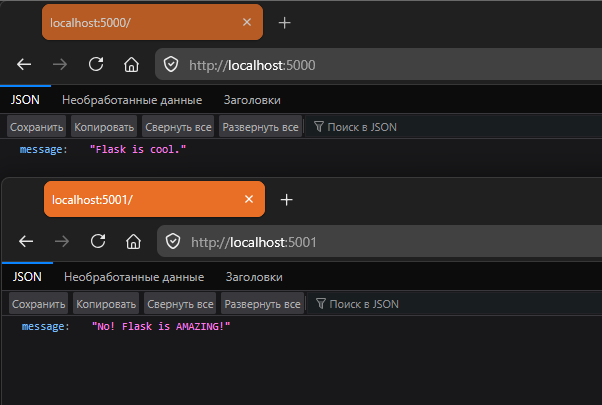

# Прикладные информационные технологии
### Лабораторная работа №7:
«Docker-Compose первый взгляд»

**Цель лабораторной работы:** Разработать приложение с использованием docker-compose.yaml.

**Формулировка задания:**
1. Разработать небольшое веб-приложение (в стиле Ping Pong... запрос-ответ).   Простой путь: пример из видео на NodeJS.  Путь джедая: свой (другой) язык. Python, Go, PHP...
Порт и ответ нужно брать из переменных окружения. 
2. Составить docker-compose файл для 2 или 2+ экземпляров вашего приложения. Каждый из них должен быть на отдельном порту и с собственным Pong-ответом.
3. Записать очень короткое (видео-скринкаст-отчет | тексто-картиночный-pdf-отчет):
•	Демонстрация с короткими коментариями вашего приложения
•	Демонстрация docker-compose.yaml
•	Демонстрация работы веб-приложений (Браузер, CURL или POSTMAN)
В качестве ответа опубликуйте ссылку на отчет в облаке и ссылку на ваш репозиторий с кодом

**Выполнил:** Сибилев Антон Игоревич.

**Выполнение практического задания к лабораторной работе №7:**
Для контейнеризации было написано минимальное Flask приложение, берущее ответ из переменных окружения:
```python
import os

from flask import Flask, jsonify

app = Flask(__name__)

@app.route("/")
def pong_endpoint():
    answer_value = os.getenv("APP_ANSWER", "").strip()

    return jsonify({"message": answer_value}), 200

@app.route("/favicon.ico")
def favicon():
    return "", 204

if __name__ == "__main__":
    app.run(host="0.0.0.0", port=int(os.getenv("PORT", 8000)))
```

docker-compose.yaml
```yaml
services:
  flask-alpha:                                    # имя сервиса
    build: ./app                                  # путь к Dockerfile
    ports:
      - "5000:5000"                               # порт контейнера
    environment:                                  # переменные окружения:
      APP_ANSWER: ${APP_ANSWER:-Flask is cool.}   # ответа приложения
      PORT: 5000                                  # порта приложения
    restart: unless-stopped

  flask-beta:                                     # имя второго сервиса
    build: ./app                                  # и далее по аналогии
    ports:
      - "5001:5001"
    environment:
      APP_ANSWER: ${APP_ANSWER:-No! Flask is AMAZING!}
      PORT: 5001
    restart: unless-stopped
```

Dockerfile
```dockerfile
FROM python:3.14-alpine3.22

# указание рабочего каталога внутри контейнера
WORKDIR /app

# копирование файлов
COPY . /app
# установка зависимостей
RUN pip install --no-cache-dir -r requirements.txt

# открытие порта
EXPOSE 5000

# запуск приложения
CMD ["python", "app.py"]

```

Демонстрация ответа приложений:


